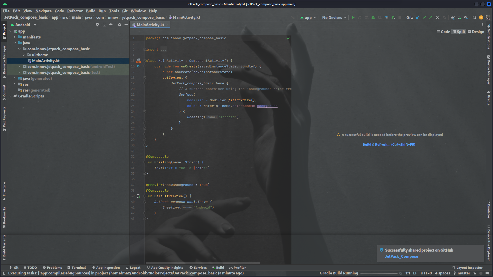
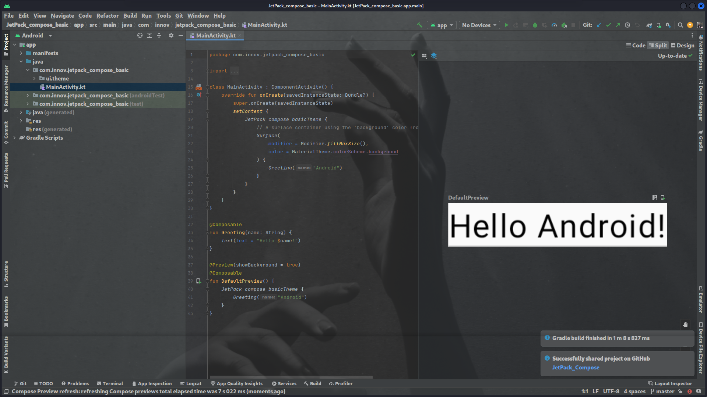

# Jetpack Compose in Kotlin - Getting Started

This repository provides a guide and code samples to help you get started with Jetpack Compose in Kotlin. Jetpack Compose is a modern UI toolkit for building native Android user interfaces.

# Jetpack Compose
## Prerequisites

    Android Studio 4.2 or later
    Kotlin 1.5.0 or later
    Android Gradle Plugin 7.0.0 or later
    Android SDK 30 or later

## Installation

    Clone or download this repository to your local machine.
    Open Android Studio and select "Open an existing Android Studio project."
    Navigate to the downloaded repository folder and click "OK."

## Project Structure

### The project is structured as follows:

├── app
│   └── src
│       ├── main
│       │   ├── java/com/example/myapp
│       │   │   └── MainActivity.kt
│       │   └── res
│       │       ├── layout
│       │       │   └── activity_main.xml
│       │       └── values
│       │           └── colors.xml
│       └── ...
└── ...

### Usage

    Open the MainActivity.kt file located in app/src/main/java/com/example/myapp.
    Update the code to create your Compose UI using Composable functions.
    Run the app on an emulator or physical device to see the result.

import android.os.Bundle
import androidx.appcompat.app.AppCompatActivity
import androidx.compose.foundation.Text
import androidx.compose.material.MaterialTheme
import androidx.compose.material.Surface
import androidx.compose.runtime.Composable
import androidx.compose.ui.platform.setContent

class MainActivity : AppCompatActivity() {
    override fun onCreate(savedInstanceState: Bundle?) {
        super.onCreate(savedInstanceState)
        setContent {
            MyApp {
                Greeting("Hello, Jetpack Compose!")
            }
        }
    }
}

@Composable
fun MyApp(content: @Composable () -> Unit) {
    MaterialTheme {
        Surface {
            content()
        }
    }
}

@Composable
fun Greeting(message: String) {
    Text(text = message)
}

# Screenshots

## Resources

    Jetpack Compose Documentation
    Compose Academy
    Jetpack Compose Samples

## License

This project is licensed under the MIT License.

Feel free to contribute to the project by submitting pull requests or reporting issues. Happy coding!
